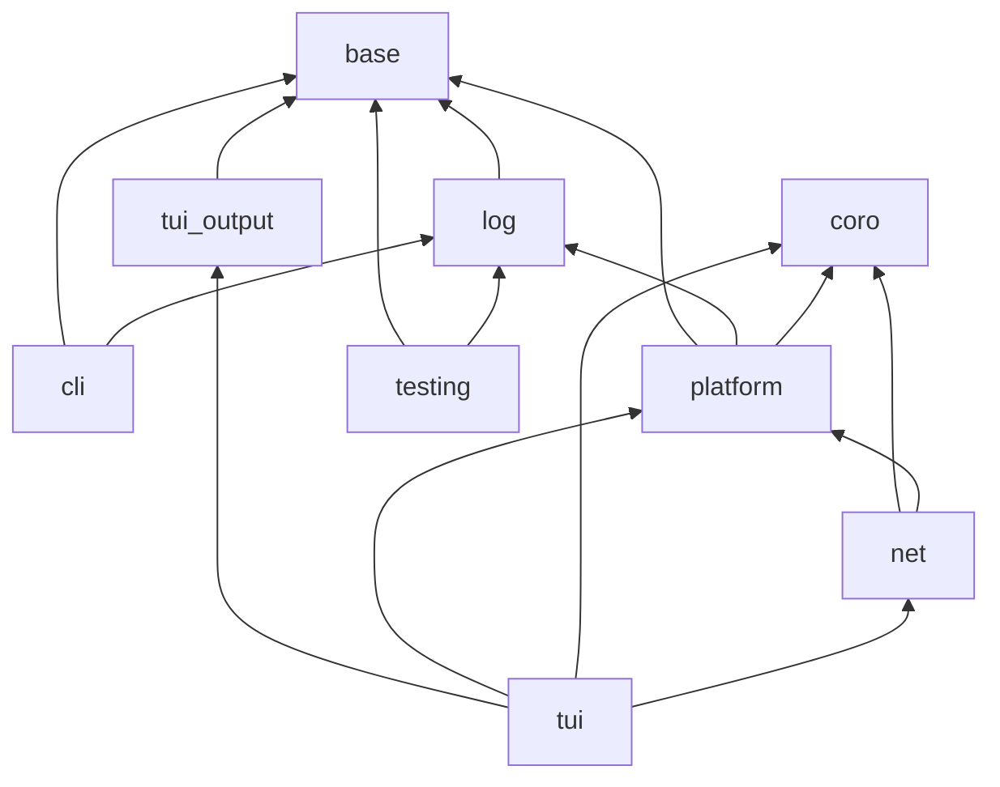

# Modules

core-cpp is one CMake project with one module per directory under `src/core/`. A module's
namespace is its directory (`src/core/net/` is `core::net`; headers directly in `src/core/` are
`core`), its real targets are named `core-cpp-<name>`, and consumers link the aliases
`core::<name>`.

| Module | Namespace | Target(s) | Kind | Depends on | Status |
|---|---|---|---|---|---|
| [base](base.md) | `core` | `core::base` | static | Threads; Tracy (optional) | available |
| [log](log.md) | `core::log` | `core::log` | static | base | available |
| [cli](cli.md) | `core::cli` | `core::cli` | static | base, log | available |
| [platform](platform.md) | `core::platform` | `core::platform` | static | base, log, coro | planned: Task A4 |
| [coro](coro.md) | `core::coro` | `core::coro` | header-only | the standard library | planned: Tasks A5, B1 |
| [net](net.md) | `core::net` | `core::net_types`, `core::net`, `core::net_tls` | header-only, static, static | coro, platform; OpenSSL for `net_tls` | planned: Tasks A6, B2 to B11 |
| [tui](tui.md) | `core::tui` | `core::tui_output`, `core::tui` | static | `tui_output`: base; `tui`: also platform, coro, net, libunicode, stb (optional) | planned: Tasks A7, B12 |
| [testing](testing.md) | `core::testing` | `core::testing`, `core::testing_dialogs`, `core::testing_main` | static, object, static | base; log and Catch2 for `testing_main` | available |

The task numbers refer to the
[implementation plan](https://github.com/contour-terminal/core-cpp/blob/master/docs/superpowers/plans/2026-09-18-core-cpp.md).

## Layering

A module may link only the modules its row in
[`cmake/CoreCppModules.cmake`](https://github.com/contour-terminal/core-cpp/blob/master/cmake/CoreCppModules.cmake)
lists, and every one of those must appear in an earlier row. The configure refuses anything else,
so the graph below is enforced rather than documented:

`coro` depends on the standard library only, so it can be used without anything else from
core-cpp. `tui_output` depends on `base` only, so a program can write styled terminal output
without an event loop, coroutines or libunicode; Lightweight's `dbtool` uses it that way.

## Public and private headers

A module's public headers are the ones in its `FILE_SET HEADERS`, included as
`<core/<module>/<Header>.hpp>`. Its `detail/`, `posix/`, `linux/`, `darwin/`, `windows/` and
`backend/` subdirectories, and the TUI's `platform/`, are private and in no file set. A module's
`testing/` subdirectory holds its test doubles; they are public and compiled into the module, so
a consumer's tests can use them.

## The WebAssembly subset

Under single-threaded Emscripten (emsdk 3.1.56 and the latest release, no pthreads) only this
subset builds, and CI runs its tests under node:

| Module | Under Emscripten |
|---|---|
| base, log, cli | fully |
| coro | everything except `ThreadPoolExecutor.hpp` |
| platform | Types, NativeHandle, PlatformError, Clock, StringUtils, PathUtils, GlobMatch, FileUri |
| net | `net_types`, `IoBackend`, `EventLoop`, timers, `DeadlineTimer`, `WithTimeout`, the host-driven backend and the test doubles; no sockets, DNS, TLS or HTTP |
| testing | fully (the Windows parts are no-ops) |
| tui | never |

Code in the subset uses no `std::thread`, no blocking wait and no `Threads::Threads`, and checks a
`__cpp_lib_*` feature-test macro before using a library facility newer than libc++ 18.
